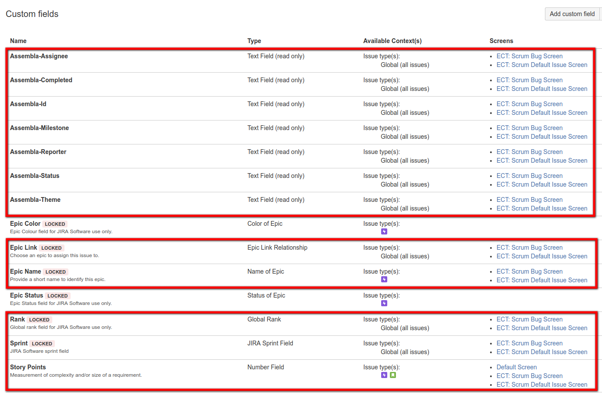

# Assembla-to-Jira

Tools for migrating data from Assembla to Jira.

## Introduction

## Preparations

You will need to goto to the Jira website and login as admin.

Create the following projects:
* Europeana Collection
* Europeana APIs
* Europeana Infrastructure

and define them as a comma-separated list in `.env` file as `ASSEMBLA_SPACES`.

Create the following new issue type:
* Spike

The issue type `spike` will be defined for any tickets whose summary starts with `Spike: `. Additionally, any tickets whose summary starts with `Epic :` will be defined as issue type `epic` (already part of the default Jira ticket types on project creation).


Create the following custom fields (text field read-only):
* Assembla-id
* Assembla-theme
* Assembla-status
* Assembla-milestone
* Assembla-reporter
* Assembla-assignee

IMPORTANT: Include each custom field in the project's `Simple Issue Tracking Create Issue` and `Simple Issue Tracking Edit/View Issue` screens, otherwise the ticket import will fail with the error message `Field 'field-name' cannot be set. It is not on the appropriate screen, or unknown`.



The same applies to the following additional (default) fields:

* Epic Name
* Rank
* Assignee
* Labels


You will also need to configure the `issue type scheme` for the project like this:


```
$ cp .env.example .env
```

## Export data from Assembla

You can run the export in a number of stages, output files being generated at each point in the process.

The output files are located in the directory `data/assembla/:space/:project` as follows:

```
$ ruby assembla_export_space.rb =>
    space_tools.csv, users.csv, user_roles.csv tags.csv milestones.csv, tickets-statuses.csv, \
    tickets-custom-fields.csv, documents.csv, wiki_pages.csv, tickets.csv
$ ruby assembla_export_tickets.rb =>
  ticket-comments.csv, ticket-attachments.csv, ticket-tags.csv, ticket-associations.csv
$ ruby assembla_report_users.rb =>
    report-users.csv
```

## Import data into Jira

You can run the import in a number of stages, output files being generated at each point in the process.

### Create projects

```
$ ruby jira_create_projects.rb
```

### Get general information

```
$ ruby jira_get_issue_types.rb
$ ruby jira_get_priorities.rb
$ ruby jira_get_resolutions.rb
$ ruby jira_get_roles.rb
$ ruby jira_get_statuses.rb
$ ruby jira_get_projects.rb
```

### Import users

Read in the Assembla user file `data/:space/:project/users.csv` and create the Jira users if they do not already exist.

```
$ ruby jira_import_users.rb
```

The following user:

* unknown.user@europeana.eu

as defined in the `.env` file as `JIRA_API_UNKNOWN_USER`.

### Import tickets

```
$ ruby jira_import_tickets.rb
```


## Assembla ticket fields:
* id
* number
* summary (x)
* description (x)
* priority (1 - Highest, 2 - High, 3 - Medium, 4 - Low, 5 - Lowest)
* completed_date
* component_id
* created_on
* permission_type
* importance (Sorting criteria for Assembla Planner) => 10104 Rank
* is_story (true or false, if true hierarchy_type = 2)
* milestone_id => 10103 Sprint
* notification_list
* space_id
* state (0 - closed, 1 - open)
* status (new, blocked, testable, in acceptance testing, in progress, ready for deploy)
* story_importance (1 - small, 4 - medium, 7 - large) => 10105 Story Points
* updated_at
* working_hours
* estimate
* total_estimate
* total_invested_hours
* total_working_hours
* assigned_to_id
* reporter_id
* custom_fields
* hierarchy_type (0 - No plan level, 1 - Subtask, 2 - Story, 3 - Epic)
* due_date

## Jira issue fields:

### Default
* issuetype
* timespent
* project
* fixVersions
* aggregatetimespent
* resolution
* resolutiondate
* workratio
* lastViewed
* watches
* thumbnail
* created
* priority
* labels
* timeestimate
* aggregatetimeoriginalestimate
* versions
* issuelinks
* assignee
* updated
* status
* components
* issuekey
* timeoriginalestimate
* description
* timetracking
* security
* attachment
* aggregatetimeestimate
* summary
* creator
* subtasks
* reporter
* aggregateprogress
* environment
* duedate
* progress
* comment
* votes
* worklog

### Custom
* 10000 Development
* 10001 Team
* 10002 Organizations
* 10003 Epic Name
* 10004 Epic Status
* 10005 Epic Color
* 10006 Epic Link
* 10007 Parent Link
* 10100 [CHART] Date of First Response
* 10101 [CHART] Time in Status
* 10102 Approvals
* 10103 Sprint
* 10104 Rank
* 10105 Story Points
* 10108 Test sessions
* 10109 Raised during
* 10200 Testing status
* 10300 Capture for JIRA user agent
* 10301 Capture for JIRA browser
* 10302 Capture for JIRA operating system
* 10303 Capture for JIRA URL
* 10304 Capture for JIRA screen resolution
* 10305 Capture for JIRA jQuery version
* 10400 Assembla

### Associations

```
0 - Parent (ticket2 is parent of ticket1 and ticket1 is child of ticket2)
1 - Child  (ticket2 is child of ticket1 and ticket2 is parent of ticket1)
2 - Related (ticket2 is related to ticket1)
3 - Duplicate (ticket2 is duplication of ticket1)
4 - Sibling (ticket2 is sibling of ticket1)
5 - Story (ticket2 is story and ticket1 is subtask of the story)
6 - Subtask (ticket2 is subtask of a story and ticket1 is the story)
7 - Dependent (ticket2 depends on ticket1)
8 - Block (ticket2 blocks ticket1)
```

See: http://api-docs.assembla.cc/content/ref/ticket_associations_fields.html

## Mappings

* Status - The value of this field is set automatically. It is never present on any editable form, and defaults to `TO DO` on ticket creation.

## Trouble-shooting

* Error "User cannot be assigned issues." => activate, login as user and then deactivate.
* If issue is an epic then the epic name custom field is required.

## License

Licensed under the EUPL V.1.1.

For full details, see [LICENSE.md](LICENSE.md).
